<div align="center">

# Bengali Subtitle Studio

**Bengali audio in. Broadcast-quality Bengali + English subtitles out.**

A Windows desktop app that turns Bengali audio or video into two production-ready
SRT files: corrected Bengali and fluent English, with timing measured from the
audio itself, never estimated.


</div>

---

## ✨ Highlights

- **One window, one button.** Pick a file, press Generate, get `name_bn.srt` and `name_en.srt`.
- **Timing you can trust.** Every cue's start and end comes from measured speech boundaries in the audio. The LLMs never see a timestamp, and a final invariant check refuses to write files if timing drifts.
- **Three-stage AI pipeline.** Google Chirp 3 speech recognition, a Bengali correction pass that uses full-transcript context to fix misheard names and brands, and a natural English translation with per-cue length budgets.
- **Professional subtitle standards, enforced locally.** Line length, cue duration, reading speed, natural line breaks, speaker dashes. Zero extra API calls.
- **Built-in preview player.** Play, pause, click-to-seek, a live caption bar, and the active cue highlighted and auto-centered in an editable SRT view. Fix a line, save, replay.
- **Safe by default.** Output files are never overwritten (`_v2`, `_v3`, ...), and your API key is stored DPAPI-encrypted, revealed only after Windows Hello or your account password.

## 🔬 How it works

```mermaid
flowchart LR
    A[Media file] -->|FFmpeg| B[16 kHz FLAC]
    B --> C[Pause detection<br/>3-pass silencedetect]
    C --> D[Cue-sized chunks<br/>cut at real pauses]
    D -->|4 parallel workers| E[Chirp 3 via OpenRouter]
    E --> F[LLM pass 1<br/>Bengali correction]
    F --> G[Standards enforcement<br/>local, token-free]
    G --> H[LLM pass 2<br/>English translation]
    H --> I[name_bn.srt<br/>name_en.srt]
```



The audio is split at real detected pauses into chunks of 1.2 to 6 seconds, each transcribed separately. The chunk's measured speech boundaries become the subtitle timing, verbatim. If a model returns word-level timestamps (Whisper does), the app upgrades to word precision automatically. Text and timing travel separate roads: the LLM passes exchange text keyed by cue id only, so no model output can ever move a subtitle.

## 📏 Subtitle standards

All enforced locally after correction, before translation, so both files stay cue-for-cue aligned:

| Rule | Value |
| --- | --- |
| Line length | max 42 characters, max 2 lines, single line preferred |
| Cue duration | 0.833 s to 7 s |
| Reading speed | 17 chars/s Bengali, 20 chars/s English |
| Cue gap | at least 2 frames, or exactly contiguous |
| Line breaks | at natural language boundaries |
| Speaker changes | one speaker per line, leading dash |

Long cues split at word and punctuation boundaries with time divided proportionally to text length. Short cues merge into contiguous neighbours. Reading speed is relaxed by extending a cue into the following silence, never past the next cue. Lines never end on an article, preposition, or conjunction (English and Bengali lists), never separate a number from its unit, and never break hyphenated pairs.

## 🚀 Quick start

### Option 1: download the exe (nothing to install)

Grab `Bengali Subtitle Studio.exe` from [Releases](https://github.com/abhirup780/bengali-subtitle-studio/releases). FFmpeg is bundled inside; the only thing you need is an [OpenRouter API key](https://openrouter.ai/keys).

> Windows SmartScreen may warn on first run because the binary is unsigned. Choose "More info", then "Run anyway".

### Option 2: run from source

**Requirements:** Windows 10/11, Python 3.10+, [FFmpeg](https://ffmpeg.org/) on PATH (`winget install Gyan.FFmpeg`), an [OpenRouter API key](https://openrouter.ai/keys).

```powershell
git clone https://github.com/abhirup780/bengali-subtitle-studio.git
cd bengali-subtitle-studio
py app.py
```

The core app is **pure standard library**. The optional Windows Hello prompt uses the WinRT bridge:

```powershell
pip install winrt-runtime winrt-Windows.Security.Credentials.UI winrt-Windows.Foundation
```

Without it, the app falls back to a Windows account password check.

**Workflow:**

1. Choose an audio or video file (mp3, wav, m4a, mp4, mkv, mov, flac, ogg, aac, webm)
2. Paste your OpenRouter API key once (stored encrypted)
3. Optionally add a custom instruction for both LLM passes, e.g. mask profanity, fix a name's casing
4. Generate, then review in the preview player, edit any line, save

Already have subtitles? **Open preview** accepts any one file of a set (the media or either SRT) and auto-detects the rest, always choosing the latest version.

## 📦 Building the executable

```powershell
pip install pyinstaller
py -m PyInstaller --noconfirm --onefile --noconsole --icon app.ico --add-data "app.ico;." --add-binary "ffmpeg_bin\ffmpeg.exe;." --collect-submodules winrt --collect-data winrt --name "Bengali Subtitle Studio" app.py
```

Place an `ffmpeg.exe` in `ffmpeg_bin/` first (any static Windows build) to bundle it; omit the `--add-binary` flag to build a smaller exe that uses FFmpeg from PATH instead. The result is a single portable `dist/Bengali Subtitle Studio.exe`.

## ⚙️ Configuration

Stored in `%APPDATA%\BengaliSubtitleStudio\config.json`:

| Setting | Default | Notes |
| --- | --- | --- |
| Speech-to-text model | `google/chirp-3` | any model on OpenRouter's transcription endpoint |
| LLM model | `google/gemini-3.1-flash-lite` | any OpenRouter chat model |
| Language | `bn-IN` | or `bn-BD` |
| API key | none | DPAPI-encrypted, bound to your Windows account |

The output folder and custom instruction are per-run choices and reset on launch.

## 🏗️ Architecture

<details>
<summary>Module map (click to expand)</summary>

```
app.py                      Tkinter UI, preview player, event loop
bnsrt/
  pipeline.py               Stage orchestration, parallel chunk transcription
  chunker.py                Pause detection and chunk planning
  ffmpeg.py                 Audio extraction and preview transcoding
  segmenter.py              Word/segment timings to subtitle cues
  standards.py              Subtitle standards enforcement
  srt.py                    Cue model, line wrapping, SRT read/write
  passes.py                 LLM correction and translation passes
  openrouter.py             HTTP client with retry and backoff
  pairing.py                Audio/subtitle set auto-detection
  player.py                 Audio playback (Windows MCI)
  secret.py                 DPAPI secret storage
  winauth.py                Windows Hello / password verification
  config.py                 Settings persistence
  providers/
    base.py                 TranscriptionProvider / LlmProvider interfaces
    openrouter_stt.py       Chirp 3 and compatible transcription models
    openrouter_llm.py       OpenRouter chat models
```

</details>

Providers are swappable: implement `TranscriptionProvider` or `LlmProvider` from `bnsrt/providers/base.py` and hand instances to `Pipeline`.

**Error handling:** transient API failures retry with exponential backoff; a single rejected chunk becomes an empty cue while auth, quota, and rate-limit exhaustion abort loudly; malformed LLM batches retry, then fall back safely (correction keeps the original text, translation retries line by line).

## ⚠️ Limitations

- Windows only: playback uses MCI, secrets use DPAPI, identity uses Windows Hello
- Subtitle timing is audio-derived; alignment to video shot cuts is out of scope
- Not an SDH pipeline: no sound-effect captions, no speaker diarization from the model

## 📄 License

MIT. See [LICENSE](LICENSE).

The packaged executable bundles [FFmpeg](https://ffmpeg.org/) (gyan.dev build, GPLv3) as a separate invoked program; FFmpeg source is available at ffmpeg.org.

<div align="center">

Built by **Abhirup Sarkar**

</div>
